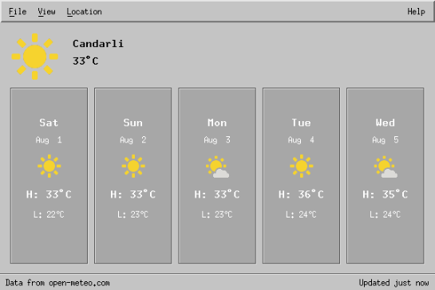
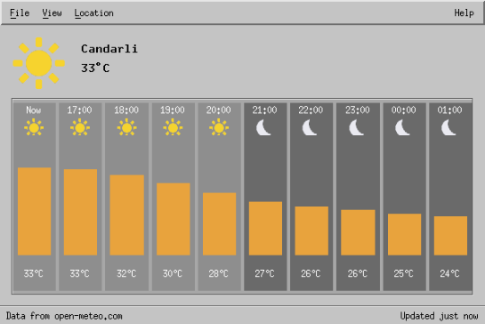

# XWeather

A contemporary X11/Motif weather application, inspired by [Gnome Weather](https://apps.gnome.org/Weather/). Runs great on [SGI IRIX](https://en.wikipedia.org/wiki/IRIX), MacOS, and Linux.

 

## Features

- Live weather data from open-meteo.com
- Daily and hourly forecast views
- Easily manage and switch between multiple location
- Written in C and X11/Motif for maximum compatibility with vintage UNIXes. 

## Acknowledgements 

- The folks at [Gnome Weather](https://apps.gnome.org/Weather/) for visual inspiration and a great set of [weather icons](./assets/icons).